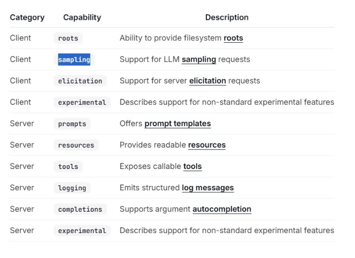
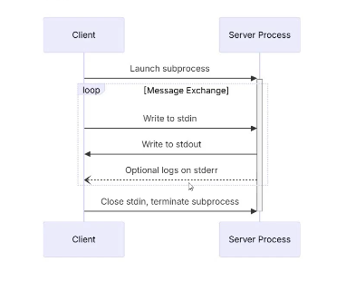

URI - fixed and static -- resources 
URI - dynamic -- resource template
dynamic -- 1+ placeholder

npx @modelcontextprotocol/inspector

--- Lifecycle :
- Initialization - Capability negotiation & protocol version aggrement (client | server)
            - establish protocol version compatibility
            - exchange and negotiate capabilities
            - share implementation details

- Operation - Normal protocol communication
- Shutdown - Graceful termination of connection

Transport :
- stdio
    - client launches MCP server as subprocess.
    - server reads JSON-RPC msg from its std i/p (stdin) and sends msg to its std o/p (stdout)

- streamble http
    - server operates at independent process - handle multiple client connections.
    - server can optionally make use of Server Sent Events to stream multiple server msg.

- sending msg to server:
    - client must use HTTP POST to send JSON-RPC msg to MCP endpoint.
    - client must incluse Accept header, listing both application/json & text/event-stream.
    - body of POST request must be a single JSON-RPC request, notification or response.

-- SAMPLING :
Tools interact with LLMs through sampling(generating text)...

